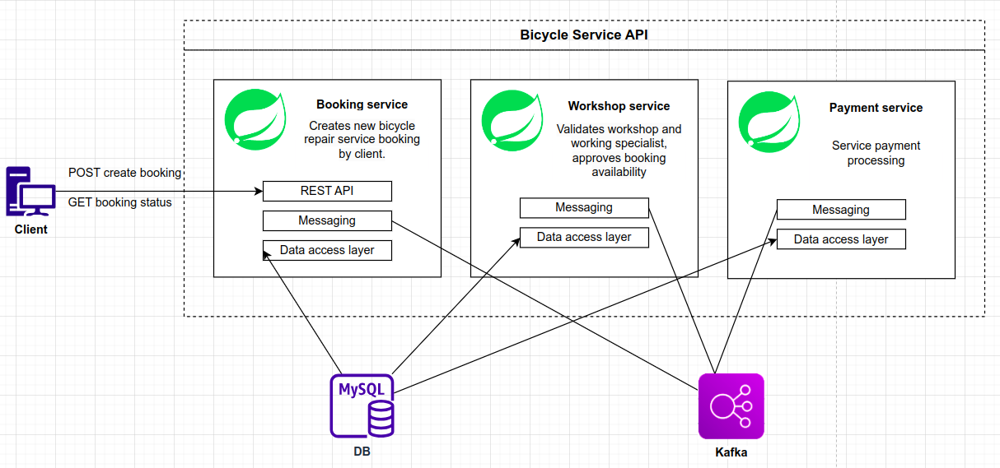
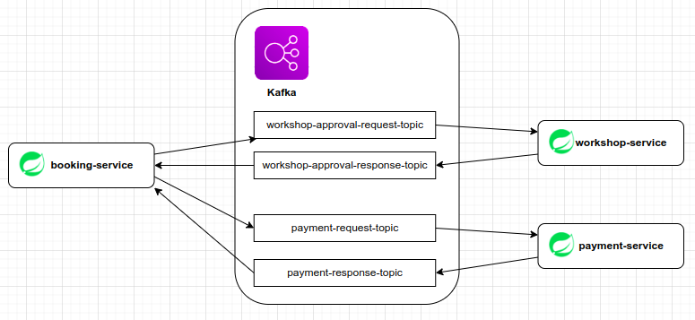

#### NOTHING BUT SOME NOTES YET

# The Bicycle Service API

Bicycle service online is an alternative to the traditional bicycle workshop.
We understand people live busy lives, it's not always convenient to drop off your bicycle at a workshop and schedule
a time to collect it, addressing this primary concern we offer easy, convenient and reliable service just a click or
phone call away!

- [Overview](#Overview)
- [Running the Application](#Running the Application)

Overview
=======================================================
Bicycle online workshop is an application created to practice the skill of building a microservice architecture with a 
combination of DDD. The approaches and methodology used in Hexagonal Architecture could be found here also.

>Good architecture allows the software to be changed during its lifetime with as little, constant effort as possible." 
"Clean Architecture" Robert C. Martin

The Bicycle Service api is responsible for creating booking for the door step service by UI client. 
Monitoring the booking status during repair service provision.

There are three main modules that communicate with each other by sending events using Kafka.

- `booking-service` component contains the REST api which could be called form the user interface. This module is
implements a business logic about booking creation and monitoring booking status.
- `workshop-serice` approves the booking by validating the business rules like workshop and specialists availability.
- `payment-serive` component processes the booking payment

Running the Application
=======================================================
1. Ensure variables the next environment variables have been set: DB_URL, DB_USERNAME, DB_PASS
2. Start PostgreSQL db and run migrations. To do this go to the `db-schema` module and run `docker-compose up` command.
Execute `./gradlew flywayMigrate` command to run migrations and create schema with required tables data.
3. Create kafka message brokers and necessary topics simply running `docker-compoe up` command in `kafka` module. 
4. Start `booking-service`, `workshop-service` and `payment-service` with  
   `./gradlew bootRun` or using your IDE.

   

## DDD
### Strategic phase
[Bounded Context (BCs)](https://martinfowler.com/bliki/BoundedContext.html)

In the strategic phase we identify the BCs and map them out in a context map.
Context map detailing the BCs and their relationships:

### Entity

Domain entities implements critical business rules and are not the same with jpa entities.
Obviously domain entities are mutable, we can easily change entity state, client name etc.
From the other hand, the greater part of domain entity must consist of immutable value objects instead of primitives.
They must have a unique identifier of any type, which may be shared among bounded contexts.This identifier should not match to the jpa entity ID value. 

Recommendation: try to avoid using primitives when implement the domain entity. It's better to use value objects and sub-entities 
to support domain entity consistency.  Each context is allowed to have a private version of a given entity.

### ID as value object

According to the Eric Evans`s book "Domain-Driven Design. Tackling Complexity in the Heart of Software":

* Many objects are not fundamentally defined by their attributes, but rather by a thread of continuity and identity.
* Eric Evans (Domain-Driven Design. Tackling Complexity in the Heart of Software [53])
*
* An object must be distinguished from other objects even though they might have the same attributes.
* Mistaken identity can lead to data corruption.
* Eric Evans (Domain-Driven Design. Tackling Complexity in the Heart of Software [54])
*
* An object defined primarily by its identity is called an ENTITY.
* Eric Evans (Domain-Driven Design. Tackling Complexity in the Heart of Software [55])
*
* If one module depends upon another, that dependency should be physical, not just logical.
* Robert C. Martin (Clean Code: A Handbook of Agile Software Craftsmanship)

Entity should have an identity. It's recommended to represent the entity identity as a Value Object what is
* consistent and easily validated.
* Using this approach, we are sure that all the id instances are valid.
* 
[3 Reasons to Model Identity as a Value Object](https://buildplease.com/pages/vo-ids/)

## Aggregate Root
Martin Fowler (https://martinfowler.com/bliki/DDD_Aggregate.html)
>Aggregates are the basic element of transfer of data storage - you request to load or save whole aggregates. Transactions should not cross aggregate boundaries.

Evans DDD:
>An AGGREGATE is a cluster of associated objects that we treat as a unit for the purpose of data changes. Each AGGREGATE has a root and a boundary. The boundary defines what is inside the AGGREGATE. The root is a single, specific ENTITY contained in the AGGREGATE.

And:

>The root is the only member of the AGGREGATE that outside objects are allowed to hold references to[.]

In the context of the repository pattern, aggregate roots are the only objects your client code loads from the repository.

An example is a model containing a Customer entity and an Address entity. We would never access an Address entity directly from the model as it does not make sense without the context of an associated Customer. So we could say that Customer and Address together form an aggregate and that Customer is an aggregate root.

The repository encapsulates access to child objects - from a caller's perspective it automatically loads them, either at the same time the root is loaded or when they're actually needed (as with lazy loading).

For example, you might have an Order object which encapsulates operations on multiple LineItem objects. Your client code would never load the LineItem objects directly, just the Order that contains them, which would be the aggregate root for that part of your domain.

## Domain Event
Martin Fowler: (https://www.martinfowler.com/eaaDev/DomainEvent.html)
>Captures the memory of something interesting which affects the domain

## Domain Services
(https://aspnetboilerplate.com/Pages/Documents/Domain-Services)

Domain Services (or just Services in DDD) is used to perform domain operations and business rules. In his DDD book, Eric Evans describes a good Service in three characteristics:

- The operation relates to a domain concept that is not a natural part of an Entity or Value Object.
- The interface is defined in terms of other elements of the domain model.
- The operation is stateless.

## The differences between a domain service and an application services are subtle but critical:
(http://gorodinski.com/blog/2012/04/14/services-in-domain-driven-design-ddd/)

- Domain services are very granular where as application services are a facade purposed with providing an API.
- Domain services contain domain logic that can’t naturally be placed in an entity or value object whereas application services orchestrate the execution of domain logic and don’t themselves implement any domain logic.
- Domain service methods can have other domain elements as operands and return values whereas application services operate upon trivial operands such as identity values and primitive data structures.
- Application services declare dependencies on infrastructural services required to execute domain logic.
- Command handlers are a flavor of application services which focus on handling a single command typically in a CQRS architecture.
